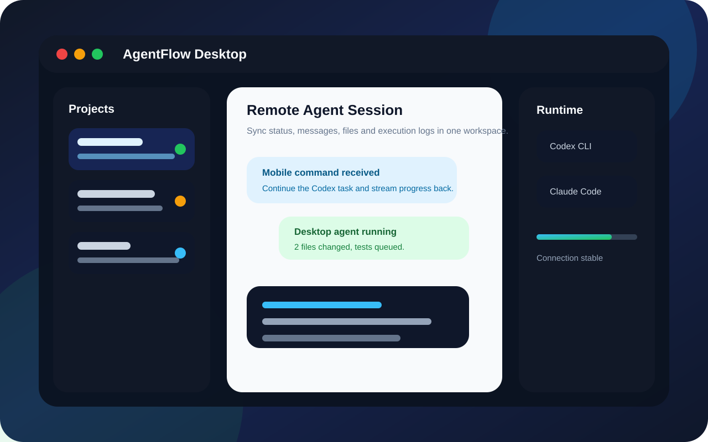
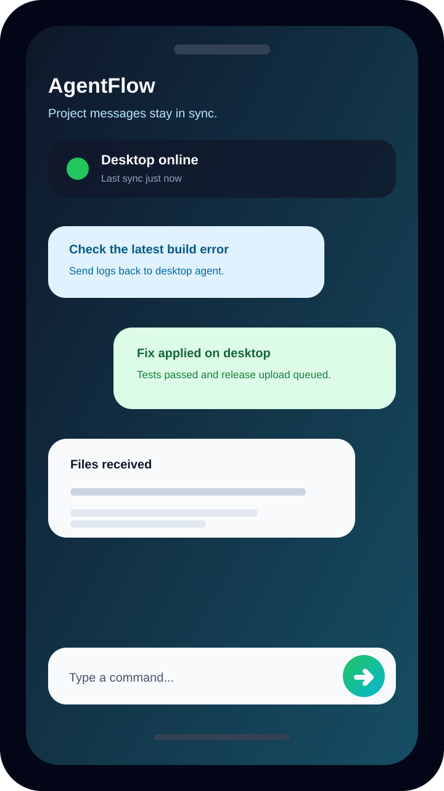
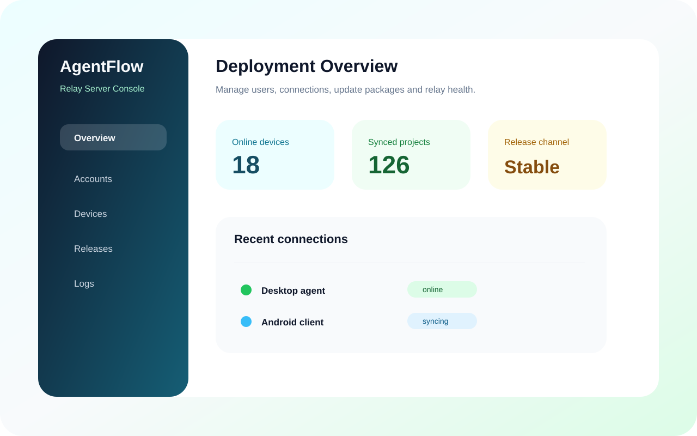

# AgentFlow

[English](./README.en.md)

如果这个项目对你有帮助，欢迎先点一下 GitHub 右上角的 **Star**。
这对项目继续维护、打包多端版本、补文档和修兼容问题都很有用。

## 这是做什么的？

`AgentFlow` 是一套可以自己部署的远程 AI 编程协作工具。

简单说：AI 编程工具还是跑在你的电脑上，你离开电脑以后，可以用手机继续看项目进度、看消息、发指令、收文件。中间的同步服务也可以部署在你自己的服务器上，不用把项目消息交给第三方中转。

它不是普通聊天软件，也不是远程桌面。它更像是：

```text
Android App  <-->  Relay Server  <-->  Desktop Agent  <-->  Claude Code CLI / Codex CLI
```

也就是手机负责查看和操作，服务器负责中转，桌面端负责真正执行 AI 编程任务。

## 界面预览

| 桌面端工作台 | Android 聊天 | 管理后台 |
| --- | --- | --- |
|  |  |  |

## 适合谁用？

- 经常在电脑上使用 Claude Code、Codex 这类 CLI Agent 的开发者
- 希望“电脑继续跑任务，手机随时跟进”的个人或团队
- 需要远程查看办公室电脑、现场机器、机房机器执行状态的人
- 想自己部署账号、中转服务、更新中心，不想依赖公共云中转的人
- 希望项目消息和历史记录长期按项目保存的人

如果你只是想远程控制整台电脑，或者只是想做一个普通 IM 聊天工具，这个项目不是为那个场景设计的。

## 现在能做什么？

- 在 Android 手机上查看桌面端项目列表、聊天记录和运行状态
- 从手机给某个桌面项目继续发消息，让电脑上的 Agent 接着执行
- 同步桌面端的消息、活动、附件、文件和任务状态
- 按项目保存历史记录，减少每次同步的流量
- 自己部署 Relay Server，管理账号、设备、连接和更新
- 桌面端和 Android 端都支持版本检查和更新分发
- 桌面端支持 Claude Code CLI / Codex CLI，并逐步补齐多平台打包

## 项目由哪几部分组成？

```text
.
|-- android-app/   Android 客户端
|-- local-agent/   Electron 桌面端 Agent
|-- relay-server/  Go 中转服务和管理后台
|-- docs/          详细文档
|-- CLAUDE.md      项目协作说明
```

### `android-app/`

手机端。主要负责登录、查看项目、发送消息、接收同步内容、下载更新包。

### `local-agent/`

桌面端。负责连接服务器、管理本地项目、调用 Claude Code CLI / Codex CLI、保存本地历史记录。

### `relay-server/`

你自己部署的中转服务。负责登录认证、消息同步、设备管理、后台管理、版本发布和更新检查。

## 一次典型使用流程

1. 在电脑上安装并启动桌面端 `local-agent`。
2. 桌面端连接本机的 Claude Code CLI 或 Codex CLI。
3. 在自己的服务器上部署 `relay-server`。
4. Android App 登录同一个账号。
5. 手机端看到电脑上的项目、消息和运行状态。
6. 你在手机上继续发指令。
7. 桌面端收到后继续执行，结果再同步回手机。

这个流程适合出门后继续跟进代码任务，也适合现场调试、部署跟进、远程排查这类需要“有人授权、有记录、有边界”的协作场景。

## 和远程桌面有什么区别？

- 远程桌面传的是屏幕，AgentFlow 同步的是项目消息、活动、状态和文件。
- 远程桌面通常是直接操作整台机器，AgentFlow 更偏向按项目协作。
- 普通聊天软件只保存聊天，AgentFlow 关心的是本地 Agent 的执行链路和项目历史。
- SaaS 工具通常由平台托管中转，AgentFlow 的 Relay Server 可以自己部署。

## 快速开始

### 1. 启动 Relay Server

```bash
cd relay-server
go build ./...
go test ./...
```

常用环境变量：

- `PORT`
- `JWT_SECRET`
- `LOG_LEVEL`
- `CORS_ORIGINS`
- `DATA_DIR`
- `DATABASE_PATH`
- `ADMIN_USER`
- `ADMIN_PASSWORD`

### 2. 启动桌面端

```bash
cd local-agent
npm install
npm run build
npm start
```

打包 Windows 安装包：

```bash
cd local-agent
npm run dist:win
```

### 3. 构建 Android App

```bash
cd android-app
./gradlew.bat :app:compileDebugKotlin
./gradlew.bat :app:assembleRelease
```

Linux / macOS 下把 `./gradlew.bat` 换成 `./gradlew`。

## 本地数据放在哪里？

### 桌面端

默认数据目录：

- `%APPDATA%\claude-code-agent`

常见文件：

- `config.json`：服务器地址、账号信息、项目列表、默认配置
- `app-settings.json`：启动、更新、日志等系统设置
- `i18n.json`：界面语言
- `runtime-history/<projectId>.json`：项目历史、活动、队列和会话状态

### Android

Android 端使用 Room 和 Preferences 保存：

- 已同步消息
- 每个项目的同步游标
- 本地聊天快照
- 登录状态和更新设置

## 更新中心

更新中心内置在 `relay-server` 中。

支持：

- 桌面端检查更新
- Android 端检查更新
- 自动检查更新
- 自动下载安装包
- 安装动作仍由用户确认，避免后台静默改系统

示例接口：

```text
/api/update/check?platform=desktop-win&channel=stable&arch=x64&version=1.0.0&build=0
/api/update/check?platform=android&channel=stable&arch=&version=1.0.0&build=1
```

## 常用文档

- [完整文档目录](./docs/README.md)
- [架构总览](./docs/architecture-overview.md)
- [Relay Server 部署](./docs/relay-server-deployment.md)
- [GitHub CI/CD 与多平台支持](./docs/github-cicd-and-platform-support.md)
- [发布与更新中心](./docs/release-and-update-center.md)
- [消息同步与更新故障排查](./docs/message-sync-update-troubleshooting.md)
- [桌面端说明](./local-agent/README.md)
- [English README](./README.en.md)

## 开源和安全说明

- 不要把真实生产域名、服务器 IP、数据库文件、发布脚本和口令提交到仓库。
- 本地部署脚本请保留在本机，并加入 `.gitignore`。
- 安装包和 APK 通过 GitHub Releases 或更新中心分发，不要直接提交到源码仓库。
- 公开文档里的账号、密码、服务器地址都应使用占位符。

## License

本项目使用 [MIT License](./LICENSE)。
