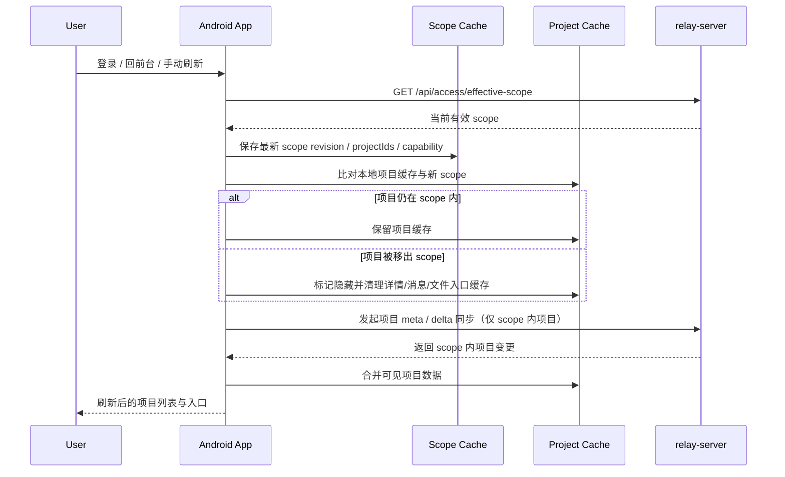
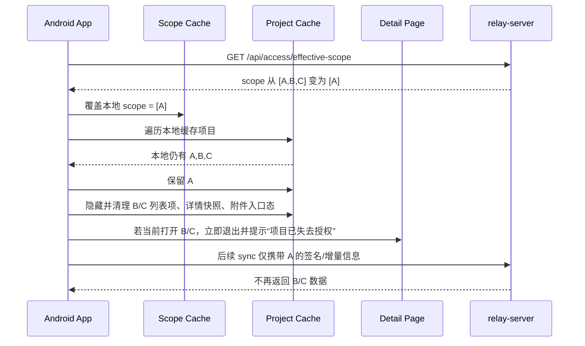

# Android scope 收缩与缓存清理时序图

更新时间：2026-04-18
关联方案：[`docs/project-scope-access-mvp.md`](./project-scope-access-mvp.md)

## 1. 目标

这份文档只解决一个核心问题：

> 当授权范围缩小、过期或被撤销时，Android 端怎样把本地旧项目、旧入口和旧缓存及时收缩掉，并避免继续同步越权内容。

## 2. 关键原则

- `effective-scope` 是移动端本地裁切的唯一真相来源
- 项目列表、项目详情、文件入口、诊断入口都不能只依赖旧缓存
- scope 缩小时先做本地裁切，再做增量同步
- 被移出 scope 的项目不再参与任何后续 sync 计划

## 3. 登录/回前台/手动刷新统一时序

## 4. scope 收缩处理时序

## 5. 详情入口守卫

无论入口来自哪里，都要在进入详情前二次校验：

- 项目列表点击
- 搜索结果点击
- 最近访问记录点击
- 深链接
- 本地恢复上次打开页面

守卫顺序建议：

1. 先查本地 scope cache
2. 不在 scope 内则直接拦截，不发详情请求
3. 若本地 scope 过旧，可先触发一次轻量 refresh，再决定是否放行
4. 仍不在 scope 内则跳回列表页并提示

建议提示文案：

- “你已失去该项目访问授权”
- “当前授权不包含该项目文件下载”
- “当前授权不包含该项目诊断查看”

## 6. 本地缓存清理粒度

被移出 scope 的项目，至少处理这些本地数据：

- 项目列表可见项
- 项目详情快照
- 最近消息摘要
- 活动流摘要
- 文件入口显示态
- 诊断入口显示态
- 最近访问项目记录
- 待同步队列中的该项目任务

清理策略建议：

- 列表层先隐藏，保证用户立刻看不到
- 详情/消息/活动快照做定向删除
- 若暂时无法立即删物理缓存，也必须先做逻辑隔离，确保不能进入

## 7. 过期与撤销差异

本轮不需要做两套复杂逻辑，但提示文案可区分：

- `revoked`：提示“授权已被撤销”
- `expired`：提示“授权已过期”

两者共同约束：

- 立即退出 scope 外详情页
- 禁止继续补拉该项目
- 后续 WebSocket 推送中的该项目消息直接丢弃

## 8. 与增量同步的结合

scope 收缩后，同步层要同步收口：

- `meta` 请求只统计 scope 内项目
- `delta` 请求只上传 scope 内项目签名
- 后台补拉任务如果引用了已移出 scope 的项目，直接取消
- WebSocket catch-up 若收到 scope 外项目，客户端丢弃并记录一次越权防护日志

## 9. 测试点

最少补这些场景：

- 登录后首次拉到 `selected_projects`
- 回前台时 scope 从多项目缩到单项目
- 当前正在查看的项目被撤销
- 从旧搜索记录进入已失去授权项目
- 文件下载按钮在 scope 收缩后消失
- 诊断入口在 capability 关闭后不可见
- scope 收缩后下一次 delta 不再携带已移出项目签名

## 10. 实现拆分建议

Android 侧建议继续拆成独立小模块：

- `scope-cache-store`
- `scope-prune-coordinator`
- `project-entry-guard`
- `scope-aware-sync-filter`

这样可以把“拉 scope”“裁切本地数据”“入口守卫”“同步过滤”分开测，避免授权逻辑再次散回页面代码里。
